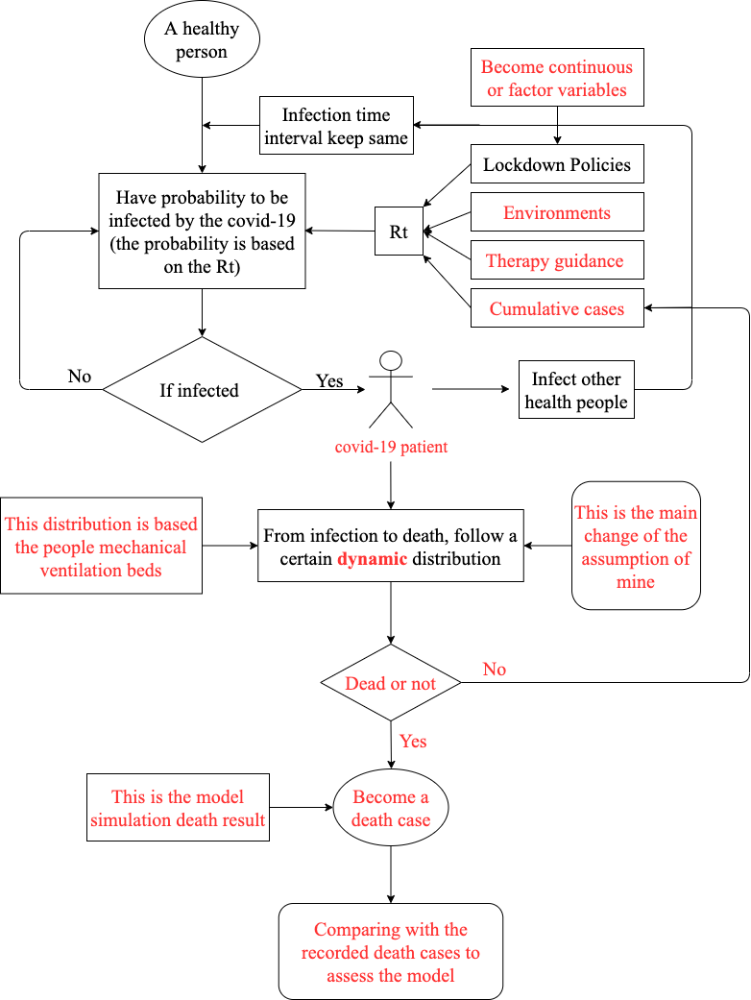

# Understanding the effect of sampling effort on covid-19 case numbers

### Wang Hanlin

## flowchart of the Simulation Approach

I use the idea of the Binomial Tree to infer the the real cases numbers

### Assumptions

1. ) keep constant

   I assume ) ~ ) 

   because in the REACT study , 39 patients reported symptoms while 87 did not. [1]

2.  keep constant

      tends to be  [2]
   
   In the reference the median is 5.2 hence, the expectation could be calculated

3. ) keep constant

   We have known ) ~ ) [3]. And 13.8% cases are servere cases, which are needed to admitted to hospital [4]. Supposing this 13.8% constant, the ) could be infered.
   

4.  p(test| symptom&Not in hospital) keep constant
    slightly willing = 60%; very willing = 90%; moderatly willing = 75% [5]
    p(test| symptom)  = 0.8*75% + 0.2*90% = 78% Assuming all servere cases are willing to test, p(test| symptom&Not in hospital)  = (78%-13.8%)/(1-13.8%)= 0.7448
    
5. sensitivity of covid-19 test is constant
    p(sensitivity) ~ Bin(449, 0.94) [6]
    
    [1]: https://spiral.imperial.ac.uk/handle/10044/1/83637 ""Community prevalence of SARS-CoV-2 virus in England during May 2020: REACT study""
    
    [2]: https://www.acpjournals.org/doi/full/10.7326/M20-0504	""The Incubation Period of Coronavirus Disease 2019 (COVID-19) From Publicly Reported Confirmed Cases: Estimation and Application""
    
   [3]: https://www.sciencedirect.com/science/article/pii/S088915912031309X	""Psychosocial factors and hospitalisations for COVID-19: Prospective cohort study based on a community sample""
   
   [4]: https://www.who.int/publications/i/item/report-of-the-who-china-joint-mission-on-coronavirus-disease-2019-(covid-19)    ""Report of the WHO-China Joint Mission on Coronavirus Disease 2019 (COVID-19)""
   
   [5]: https://papers.ssrn.com/sol3/papers.cfm?abstract_id=3670514    ""Factors Affecting Willingness to be Tested for COVID-19""
    
   [6]: https://www.bmj.com/content/370/bmj.m3682.short    ""Covid-19: Point of care test reports 94% sensitivity and 100% specificity compared with laboratory test""

    

### 

### Assumptions from infection to death

1. **The distribution of the day from infection to death is constant.**

I don’t think it is a good assumption. Also there is no specific medicine for the covid-19, the mechanical ventilation beds could definitely longer the survival time of the patients. However the number of mechanical ventilation beds is limited, many patients have no chance to use them. Hence when the more people in the mechanical ventilation beds, the shorter time from infection to death would be.

Because this parameter in this package have to be constant, **I assume that this time in a certain range (or 1 month) of time would be constant, but would change based on the people mechanical ventilation beds**

### Other assumptions

1. **Only non-pharmaceutical interventions would impact the reproduction number ($R_t$)**

(Forbid public events, schools and universities lock-down self-isolating if ill, social distancing encouraged and city lock-down)

I add two variables (**the environment temperature and the protest against the lock-down**), because the virus is sensitive to the environment temperature and not all people would abide by the lock-down rules, they want to protest on the street consequence to the increase of reproduction number.

Also **I change the dummy to the continuous variables (I would try factor variables later).**

2. **The death case confirmed by the government is certainly the truth number in the UK (with the same criteria).**

I think although it is certain that some death cases are omitted by the government, we cannot find the “truth number”, hence, this assumption should be held.

3. **The serial interval of covid-19 and the days to seed infection would be constant.**

I think it is the built-in attribute for the covid-19, which would not be impacted.

## flowchart from infection to death

